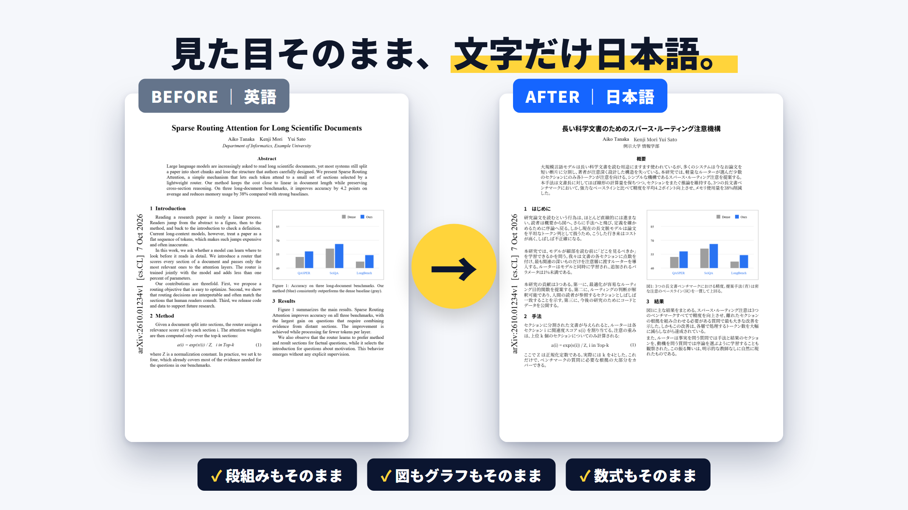

# PDF翻訳ビューア

英語の論文PDFを、**見た目はそのまま・文字だけ日本語**にして表示する Chrome 拡張機能です。

- 図・グラフ・数式・段組みはそのまま、本文だけが日本語に置き換わります
- 「対訳（左右）」「日本語訳のみ」「原文のみ」を切り替えて読めます
- 今の表示のまま PDF に保存できます（対訳はページ交互）
- 翻訳は Chrome に内蔵された AI が PC の中で行うので無料です（文章は外部に送られません）
- 設定で Gemini API キーを入れると、より高精度な翻訳も使えます

## 動作環境

パソコン版 Google Chrome 138 以降（スマホ版では動きません）

## インストール

1. [Releases](../../releases/latest) から `pdf-translate-viewer-*.zip` をダウンロードする
2. zip を展開（解凍）する。できたフォルダは消さずに置いておく
3. Chrome のアドレスバーに `chrome://extensions` と入力し、右上の「デベロッパー モード」をオンにする
4. 「パッケージ化されていない拡張機能を読み込む」を押し、展開したフォルダを選ぶ

ローカルの PDF ファイルも開きたいときは、拡張機能の「詳細」で「ファイルの URL へのアクセスを許可する」をオンにしてください。

## 使い方

1. 論文の PDF を開く（自動でこの拡張の画面に切り替わります）
2. 「翻訳開始」を押す
3. 段落にマウスを乗せると「訳し直す」「原文を表示」ボタンが出ます

### 翻訳がいらないときは（ON / OFF）

ツールバーのアイコンを押すと、小さな設定パネルが開きます。

- **「PDFを自動で翻訳ビューアで開く」をOFF** にすると、PDF はいつものビューア（Chrome 標準や Google Scholar PDF Reader など）で開きます。OFF のときはアイコンに「OFF」と表示されます
- OFF のままでも、パネルの「このPDFを翻訳ビューアで開く」で、そのPDFだけ翻訳ビューアで開けます
- 翻訳ビューアで開いたあとに翻訳がいらなくなったら、画面上部の「↩ 通常のビューアで開く」で切り替えられます

## Gemini モードについて

「⚙ 設定」で「高精度（Gemini API）」を選び、[Google AI Studio](https://aistudio.google.com/apikey) で取得した API キーを入れると使えます。
Gemini API の無料枠では、送った文章が Google のサービス改善に使われることがあります。未公開の論文などには、無料の内蔵モードを使ってください。

## ライセンス

同梱しているライブラリとフォントのライセンスは [LICENSES/README.txt](LICENSES/README.txt) を参照してください。
